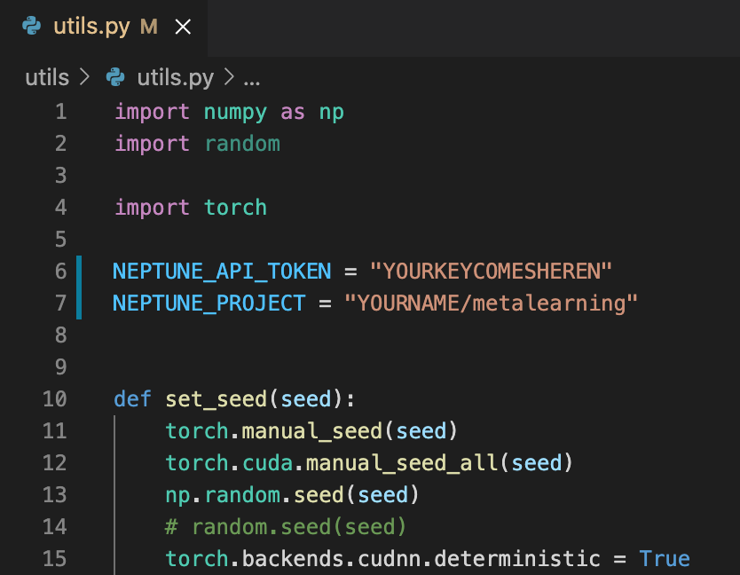

# Pytorch implementation of MAML, Prototypical Network

This repository contains the implementation of MAML and Prototypical Network on miniimagenet dataset. 
The repository is based on neptune logger so you can simply type in your neptune project name and api_token in the `utils.py` file for your use.

# Whats different from all other repositories?
- I thinks its more readable and intuitive
- Neptune logging

# Requirements and installation

The main requirements are: 
- Python 3.8+
- Pytorch 1.8
- torchvision 0.9
- neptune-client 0.13.3

## To install necessary packages
```bash
git clone git@github.com:jaeho3690/Pytorch_Proto-MAML_implementation.git
cd Pytorch_Proto-MAML_implementation
```

Install the dependencies:
```bash
conda create -n meta python=3.8
conda activate meta
conda install -y pytorch=1.8.0 torchvision=0.9.0 cudatoolkit=10.0 -c pytorch
pip install neptune-client==0.13.3
```
## To Setup for experiment

# Download miniimagenet files
```bash
sh download.sh
```
# Setup directory
```bash
mkdir episodes
mkdir logging
mkdir results
mkdir checkpoints
```

## Set your neptune api key and neptune project file in utils.py
You must set the NEPTUNE API_TOKEN and NEPTUNE_PROJECT in `utils.py` file for logging. If you do not want logging, you must comment out all logger related codes.

<p align="left"></p>

## To run all experiment files
```bash
sh proto.sh
sh maml.sh
```

## Experimental Results (N way- K shot- Q query training episode)

| Pytorch Model Name | N | K | Q | 5way-1shot-test | 5way-5shot-test | 
|---|:---:|:---:|:---:|:---:|:---|
|`MAML` | 5 | 1 | 15 |44.82 $\pm$ 0.65  | 59.13 $\pm$ 0.65 
|`MAML` | 10 |  1 | 15 |33.42 $\pm$ 0.70  | 58.18 $\pm$ 0.82 
|`MAML` | 20 | 1 | 15 | 41.41 $\pm$ 0.58 | 57.34 $\pm$ 0.59
|`MAML` | 5 |  5 | 15  |39.51 $\pm$ 0.24 | 59.63 $\pm$ 0.83 
|`MAML` | 10 |  5 | 15 | 29.73 $\pm$ 0.96 | 58.18 $\pm$ 0.82
|`MAML` | 20 |  5 | 15 |
|`Prototypical` | 5 | 1 | 15 | 49.28 $\pm$ 0.77 | 64.95 $\pm$ 0.70
|`Prototypical` | 10 |  1 | 15 | 50.19 $\pm$ 0.83 | 66.20 $\pm$ 0.70
|`Prototypical` | 20 | 1 | 15 | 46.14 $\pm$ 0.79 | 65.28 $\pm$ 0.62
|`Prototypical` | 5 |  5 | 15  | 40.93 $\pm$ 0.75 | 64.36 $\pm$ 0.67
|`Prototypical` | 10 |  5 | 15 | 37.81 $\pm$  0.76 | 62.96 $\pm$ 0.68 
|`Prototypical` | 20 |  5 | 15 | 33.43 $\pm$  0.64 | 58.39 $\pm$ 0.67
## Configurations
There are two main configuration files to understand. `meta_config` contains configurations related to meta learning experiements. We accept changes through argparser for `meta_config`. `model_config` contains all model relted configurations. You can set model specific configurations in the `config` directory.

## Configuration explanation


| meta config arguments | types | default | help |
|---|:---:|:---:|:---|
|`--model` | str |  `maml` | choose model between 'maml' or 'proto' |
|`--dataset` | str |  `miniimagenet` | select dataset. Currently only miniimagenet supported  |
|`--device` | str |  `cuda` | device |
|`--num_workers` | int |  `1` | number of workers for dataloader |
|`--N` | int |  `5` | Number of ways for training episode|
|`--K` | int |  `5` | Number of shots for training episode |
|`--Q` | int |  `5` | Number of query samples for training episode |
|`--valtest_N` | int |  `5` | Number of ways for val/test episode|
|`--valtest_K` | int |  `1` | Number of shots for val/test episode |
|`--valtest_Q` | int |  `15` | Number of query samples for val/test episode |
|`--total_train_episode_num` | int |  `60000` | Number of training episodes to run  |
|`--total_val_episode_num` | int |  `'60000'` | Number of validation episodes to run  |
|`--total_test_episode_num` | int |  `600` | Number of test episodes to run  |
|`--train_iter` | int |  `5000` | Run val() every train_iter amount of episodes |
|`--val_iter` | int |  `5000` | Run train() every val_iter amount of episodes |

| MAML arguments | types | default | help |
|---|:---:|:---:|:---|
|`inner_loop` | int |  `4` | number of episodes for inner loop |
|`inner_update_steps` | int |  `5` | # of inner updates for learning |
|`inner_update_steps_test` | int |  `10` | # of inner updates to be performed in test time |
|`inner_lr` | float |  `1e-2` | learning rate for inner update |
|`outer_lr` | float |  `1e-3` | learning rate for outer update |


| Prototypical arguments | types | default | help |
|---|:---:|:---:|:---|
|`inner_loop` | int |  `1` | number of episodes for every update. We just named inner loop to match MAML |
|`embedding-size` | int |  `64` | Embedding dimension of prototypical network |
|`in_channels` | int |  `3` | Input channel of image |
|`out_channels` | int |  `64` | Output channel of image  |
|`lr` | float |  `1e-4` | learning rate for update |

## Acknowledgment
The construction of dataset was purely mine.
- For the MAML code I took reference from https://github.com/dragen1860/MAML-Pytorch. I took reference of basic network architectures and the update methods
- For prototypical network I took reference from https://github.com/tristandeleu/pytorch-meta. I took reference of the embedding network only. 
- Codes were adapted to suit my dataset and trainer